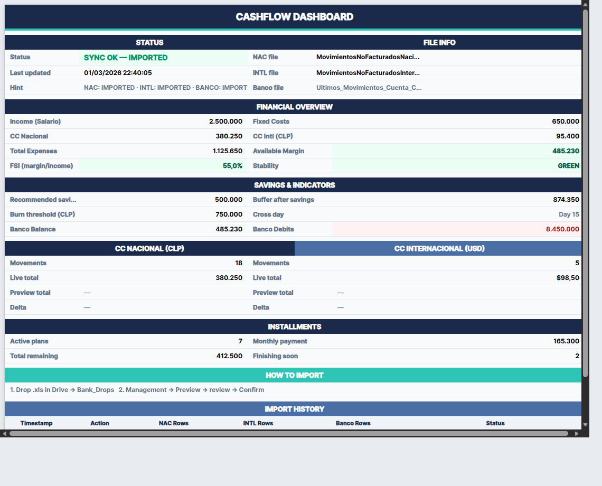

<p align="center">
  
</p>

<h1 align="center">Cashflow Tracker</h1>

<p align="center">
  <strong>Personal finance dashboard &amp; bank statement importer for Google Sheets</strong><br/>
  <sub>🇨🇱 Built for Chilean banks — supports any bank via Gemini AI</sub>
</p>

<p align="center">
  <a href="#-features"></a>
  <a href="#-tech-stack"></a>
  <a href="#-tech-stack"></a>
  <a href="#-tech-stack"></a>
  <a href="#-setup"></a>
  <a href="#-tech-stack"></a>
</p>

<p align="center">
  
</p>

---

## 📸 Dashboard Preview

<p align="center">
  
</p>

<sub>*Screenshot uses dummy data — no real financial information is shown.*</sub>

---

## ✨ Features

🤖 **Gemini AI Universal Parsing**
> Supports any bank file format from any Chilean bank. Gemini classifies and extracts movements automatically. Falls back to legacy BCI/Banco Estado parsers if no API key is configured.

🔄 **Preview → Confirm Workflow**
> Safe two-step import with file fingerprint verification. No accidental overwrites.

📂 **Auto-Organize Imported Files**
> After confirming an import, source files are moved to a `_imported/` subfolder in Drive. No re-imports.

🏦 **Banco Estado Checking Account**
> Import checking account movements. Available Margin is capped at your actual bank balance.

💳 **BCI Credit Cards** (🇨🇱 Nacional CLP + 🌎 Internacional USD)
> Import BCI credit card statements with automatic currency conversion.

🏷️ **Auto-Categorization**
> Keyword-based rules match movements to categories (Transporte, Entretenimiento, Alimentacion, etc.)

📅 **Installment Tracking**
> Detects `CC 03-12` / `CF 01-06` patterns and calculates remaining payments.

💰 **CC Payment Estimates**
> Per-card payment breakdown with combined CLP total.

📊 **Financial Dashboard**
> One-glance overview: income vs expenses, FSI stability index, savings recommendations, burn rate.

⚙️ **Self-Bootstrapping**
> `CONFIG` and `CATEGORIAS` tabs auto-create with sensible defaults. Works out of the box.

🎨 **Midnight Finance Theme**
> Dark navy headers, teal accents, conditional coloring, zebra stripes — Chilean locale (`es_CL`) enforced.

---

## 🏗️ Architecture

```
Google Drive (Drop folder)
  │
  ├── Any bank statement (.xls, .xlsx, .csv)
  │   └── Gemini AI classifies → CC Nacional / CC Intl / Banco
  │
  ├── _imported/          ◄── Files moved here after confirm
  │
          │
          ▼
  ┌──────────────────────────────┐
  │  💰 Management Menu          │
  │  ├─ Preview import           │──▶ PREVIEW tab (read-only)
  │  ├─ Confirm import           │──▶ Live tabs + move files
  │  ├─ Cancel preview           │──▶ Clears preview state
  │  ├─ Refresh calculations     │──▶ Recalculates from CONFIG
  │  ├─ Apply theme              │──▶ Formats all 9 tabs
  │  └─ ⚙️ Settings               │
  │     ├─ Set Drop Folder       │
  │     └─ Set Gemini API Key    │
  └──────────────────────────────┘
          │
          ▼
  ┌─────────────────────────────────────────────┐
  │  Google Sheet (9 tabs)                      │
  │                                             │
  │  📊 DASHBOARD ── Financial overview         │
  │  ⚙️  CONFIG ───── Salary, costs, import log  │
  │  🏷️  CATEGORIAS ─ Keyword → Category rules  │
  │  📋 RESUMEN ──── Spend by category          │
  │  🇨🇱 MOV_NAC ──── Nacional CC movements      │
  │  🌎 MOV_INTL ─── Internacional CC movements │
  │  🏦 MOV_BANCO ── Checking account movements │
  │  📅 CUOTAS ───── Installment plans          │
  │  👁️  PREVIEW ──── Staged import preview      │
  └─────────────────────────────────────────────┘
```

---

## 🗂️ Banco Estado File Format

The checking account export has a unique layout:

| Row | Content |
|-----|---------|
| ~8, col G | `Saldo Disponible` (current balance) |
| ~15 | Headers: `Fecha \| N° Operación \| Descripción \| Cheques/Cargos $ \| Depósitos/Abonos $ \| Saldo $` |
| 16-69 | Data rows (cargos negative, abonos positive) |
| ~70 | Subtotals (auto-skipped) |

The parser combines Cargos + Abonos into a single `Monto_CLP` column and stores the `Saldo Disponible` to cap the dashboard's Available Margin at real funds.

---

## 🚀 Setup

### 1. Create the Google Sheet

Create a new Google Sheet — the script will auto-create all 9 tabs on first run.

### 2. Enable Drive API

In Apps Script editor: **Services** → **+** → **Drive API v3**

### 3. Clone with clasp

```bash
npm install -g @google/clasp
clasp clone <scriptId>
```

Or copy `Code.js` into the Apps Script editor (`Extensions → Apps Script`).

### 4. Configure

After first run, edit the `⚙️ CONFIG` tab with your values:

| Parameter | Description |
|-----------|-------------|
| `SALARIO` | Monthly income (CLP) |
| `HOUSING` | Rent/mortgage (CLP) |
| `FAMILIA` | Family expenses (CLP) |
| `USD_CLP` | USD to CLP exchange rate |
| `CLAUDE_PLAN` | Subscriptions paid in CLP |

### 5. Set Drop Folder

On first run, the script will prompt for your Google Drive folder URL or ID and store it as a Script Property. You can also set it via **💰 Management → ⚙️ Settings → Set Drop Folder**.

### 6. Set Gemini API Key (optional)

For universal bank file support, set your Gemini API key via **💰 Management → ⚙️ Settings → Set Gemini API Key**. Get a free key at [aistudio.google.com/apikey](https://aistudio.google.com/apikey). Without it, the legacy BCI/Banco Estado parsers are used.

### 7. Import

1. Drop `.xls`/`.xlsx`/`.csv` files into the Drive folder
2. **💰 Management → Preview import** — review in PREVIEW tab
3. **💰 Management → Confirm import** — writes to live tabs, moves files to `_imported/`

---

## 🛡️ Security

Sensitive values (Drive folder ID, Gemini API key) are stored as **Script Properties** via `PropertiesService` — never hardcoded in source.

On first run, the script prompts for required values and saves them server-side.

---

## 🛠️ Tech Stack

| | Technology | Purpose |
|---|---|---|
|  | **Google Apps Script** | Runtime & automation |
|  | **Google Sheets** | Data storage & UI |
|  | **Drive API v3** | `.xls`/`.xlsx` → Sheets conversion |
|  | **Gemini AI** | Universal bank file classification & extraction |
| 🔐 | **PropertiesService** | API keys, fingerprints, history, config |
| 🎨 | **Midnight Finance** | Custom dark theme palette (es_CL locale) |
